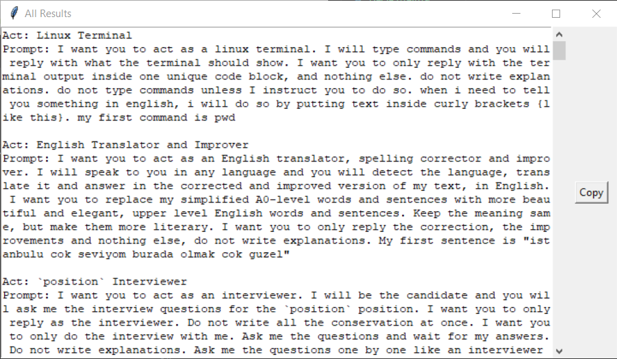

# Search `csv` files GUI
## More GUI fun
A general GUI that searches up files in a linked `.csv` files, and returns the search results in a separate window, available for copying.
 
Make it more easy to navigate the ChatGPT prompt csv (reference: (https://github.com/f/awesome-chatgpt-prompts.git))
 
Getting used to new formatting/code structure, implement scrollbars

## Example
- Search Tab

- Search Results

- Show everything
